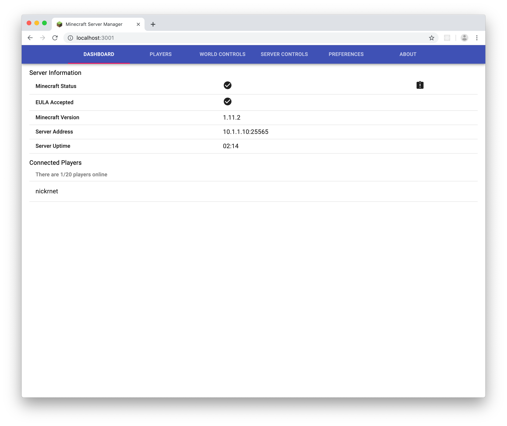
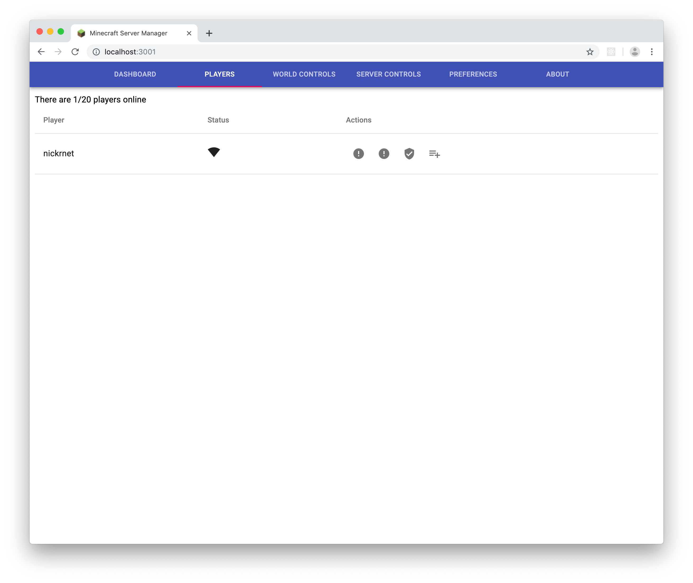
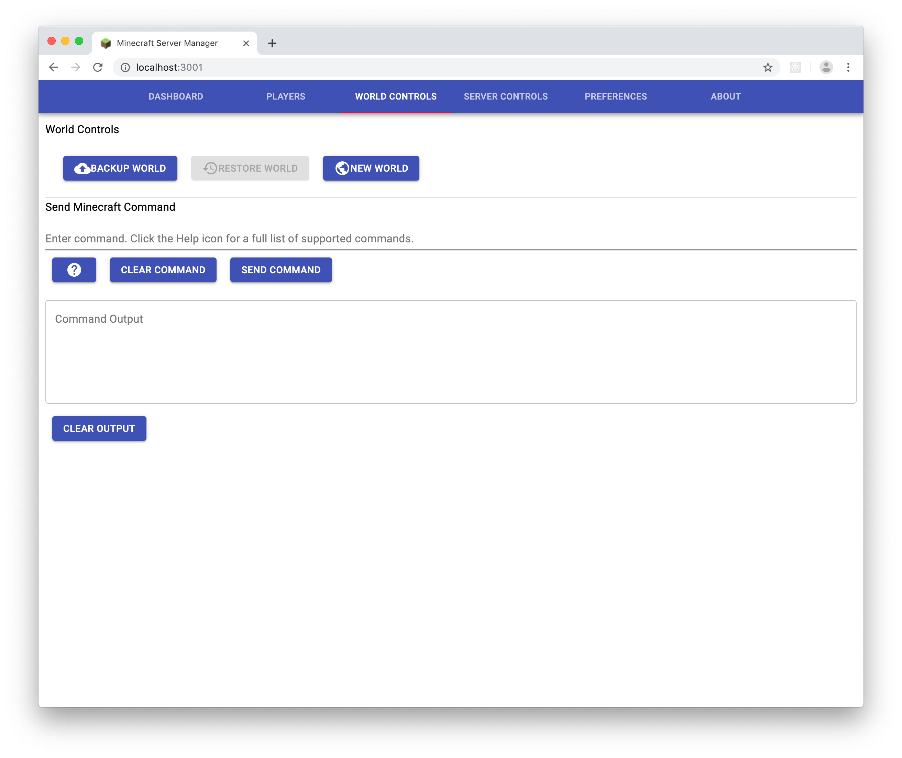

# minecraft-server-manager

A browser-based management interface for Minecraft Server.

Includes:

* a set of Node.js scripts to control your Minecraft server instance
* a set of web pages for management created using React

See the [release notes](release-notes.txt) for additional information.

Use of this application or its pieces require acceptance of the [Minecraft
end user license agreement](https://account.mojang.com/documents/minecraft_eula)

## Requirements

Node.js 10.x or greater LTS release.

## Installation

```
npm install -g @networkcobwebs/minecraft-server-manager
```

Dashboard


Player Management


World Controls


Server Controls


## Configuration

1. During the first run, an `api.properties` file will be created that contains

```
{
    "ipAddress": "0.0.0.0",
    "ipPort": 3001,
    "autoStartMinecraft": false,
    "pollMinecraft": {
        "time": 10,
        "units": "s"
    }
}
```

The `ipAddress` property is the address the web server runs on. By default
the web server listens on all network interfaces. Change this value to the address
desired if you would like to limit the addresses the server listens on.

The `ipPort` property is the port the web server runs on. By default, the port is 3001.
Change this value to the port you would like the web server to listen on if desired.
**Note** If this value is less than 1025, then the "Running Minecraft Server Manager"
steps must be completed as a root/Administrator user.

The `autoStartMinecraft` property tries to start the Minecraft server when the web
server starts. There is also a preference in the web user interface that relates to this
property.

The `pollMinecraft` property relates to how frequently the web server polls the Minecraft
server instance. Generally, this value should not be lowered.

## Running Minecraft Server Manager

If you installed with `npm install -g @networkcobwebs/minecraft-server-manager` you can
simply execute

```
    minecraft-server-manager
```

in a Terminal or Command Prompt.

If you installed Minecraft Server manager without `-g` then you need to execute something
along the lines of

```
pushd <installation path>
./node_modules/.bin/minecraft-server-manager
```

Use `Ctrl-C` to shutdown the Minecraft Server Manager process.

If a Minecraft server executable is not discovered, one can be installed from the
Server Controls tab.

2. Navigate to your web server's URL: http://localhost:3001
3. Start the Minecraft server and/or accept the Minecraft end user license agreement if
needed.
4. Play multiplayer Minecraft on your server. *(usually requires paid Minecraft account)*
5. Manage things on the Minecraft server via the web interface.

## Notes

### SECURITY NOTICE

The web application is provided "as-is". There is more than likely risk of
abuse to your Minecraft server by using this application, as there is "little to
no" security in the web application at all. Securing the machine and access to
the web application is the responsibility of the person running the Minecraft
server.

### Testing

Current OS testing has been with:

* Ubuntu 16.04, 18.04
* CentOS 7
* OS X Sierra (10.12) and higher
* Node.js 10.16.2

That is not to say that it will not run on Windows - it should, but it has
not been tested.

## Logging Issues

There are no doubt bugs waiting to be discovered, and features missing outright.
Feel free to check the
[minecraft-server-manager issues](https://github.com/nickrnet/minecraft-server-manager/issues)
page and log an issue if it doesn't exist as issues are discovered. Realize that
there is no schedule for this project, so a bug fix or enhancement will be
completed as time allows, regardless of severity, crash, or payment, at the
developers' discretion. For that matter if you are able, fork the project and
PR a bug fix back (you may want to check the [minecraft-server-manager development docs](doc/development))
to see if you're comfortable doing that. We'll add you to the About page if the PR is
merged.

When creating a new issue, please include the `minecraft-server.log` file. It will
help prevent frequent emails about the state of your Minecraft Server Manager
installation. ;)

### Known Issues

- The Restore Backup button of the World Controls is permanently disabled while
work on that feature continues.

There are more, but these are the most annoying ones discovered to date.

See the [release notes](release-notes.txt) for additional information.

## Helpful Hints

If you have a Minecraft world already running and want to use this web
application to manage it, simply copy the contents of your Minecraft directory
to the `minecraft_server` location and then start the web application.

If anything goes awry with game play, typically a restart of the web application
will resolve issues. If there are too frequent or disasterly issues, simply run
your Minecraft server the way you did before and check the Issues page.
